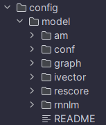

# SpeechChallenge

Made for [this YouTube video](https://www.youtube.com/watch?v=SgVvVelwKIk). Go watch it!!

Support me on [Ko-fi](https://ko-fi.com/quesia). ❤️❤️❤️

Join [this Discord server](https://discord.gg/s9m8gf6pju) for help! (After reading [the usage section](#usage))

# Usage

1. Go to https://alphacephei.com/vosk/models.
2. Download whichever model for whichever language you'd like (the large ones are the best).
3. Unzip the model to `.minecraft/config/model` (make sure it looks something like this )
4. Start the game. It will take a while to launch, keep an eye on your logs.

---

- There is a config option for the microphone in the sound settings screen.
- There is a `/cancelpunishment [player]` command, which cancels the player's punishment. Use this if the speech recognition bugs out. You have a 40 tick (2 second) window to run the command.
- There is a `/punish [amount]` command, which punishes the sender. If `amount` is specified, that number will be used to decide which punishment will be received, simulating random chance. This was just used to debug punishments, but I decided to leave it in.

# Help

Join [this Discord server](https://discord.gg/s9m8gf6pju) for help!
